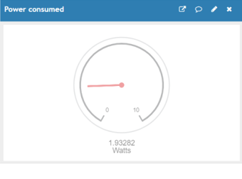

# IoT Energy Meter

A real-time electricity consumption monitoring system using IoT technology that provides live data visualization and cost tracking through cloud-based platforms.

## Table of Contents

- [Overview](#overview)
- [Motivation](#motivation)
- [Features](#features)
- [Hardware Components](#hardware-components)
- [Software Components](#software-components)
- [Usage](#usage)
- [Results](#results)
- [ThingSpeak Visualizations](#thingspeak-visualizations)
- [Future Enhancements](#future-enhancements)

## Overview

The **IoT Energy Meter** is a smart electricity monitoring system that measures energy consumption in real-time, processes the data, and uploads it to the cloud for visualization and analysis. Users can access consumption data, cost estimates, and efficiency metrics through web applications and mobile devices, receiving notifications about their electricity usage.

## Motivation

In modern life, electricity bills significantly impact monthly budgets. However, consumers typically only become aware of their consumption patterns at month-end when the bill arrives. Key challenges include:

- **Lack of Real-Time Awareness**: Users don't know their current consumption until billing
- **Budget Management**: Difficulty planning electricity expenses throughout the month
- **Manual Meter Reading**: Traditional systems require manpower for monthly readings
- **No Consumption Tracking**: Limited visibility into usage patterns and efficiency

This project addresses these problems by providing **real-time monitoring and cloud-based visualization** of electricity parameters.

## Features

### Core Functionality
- **Real-Time Monitoring**: Continuous tracking of electrical parameters
- **Cloud Data Storage**: Automatic upload to ThingSpeak cloud platform
- **Multi-Platform Access**: View data via web applications and mobile apps
- **Push Notifications**: Alerts about consumption and costs
- **Graphical Visualization**: Charts and gauges for easy data interpretation
- **Cost Calculation**: Automatic charge computation based on consumption

### Measured Parameters
- **Current**: Input and output current measurements
- **Voltage**: Real-time voltage monitoring
- **Power**: Instantaneous power consumption
- **Energy**: Cumulative energy consumed (kWh)
- **Efficiency**: System efficiency calculations
- **Cost**: Charge per unit and total amount

### ACS712 Current Sensor
- Hall-effect based linear current sensor
- High accuracy and isolation
- Low power consumption
- Available in 5A, 20A, and 30A ranges

### NodeMCU (ESP8266)
- Built-in WiFi module
- Arduino IDE compatible
- GPIO pins for sensor interfacing
- Low cost and easy to program

## Software Components

### Development Environment
- **Arduino IDE**: Programming NodeMCU
- **C/C++**: Core programming language
- **ThingSpeak API**: Cloud data upload
- **WiFi Library**: Network connectivity

### Cloud Platform - ThingSpeak
- **Real-time Data Visualization**
- **Multiple Chart Types**: Line graphs, gauges, numerical displays
- **RESTful API**: Easy data integration
- **MQTT Support**: Alternative communication protocol
- **Mobile Access**: iOS and Android apps available

### Process Steps

1. **Initialize System**
   - Configure NodeMCU WiFi connection
   - Set up ThingSpeak channel credentials
   - Initialize sensor pins

2. **Read Sensor Data**
   ```
   Read Current (I) from ACS712
   Read Voltage (V) from voltage sensor
   ```

3. **Calculate Parameters**
   ```
   Power (P) = Voltage × Current
   Energy (E) = ∫ Power × Time
   Efficiency (η) = (Output Power / Input Power) × 100
   Cost = Energy × Rate per kWh
   ```

4. **Upload to Cloud**
   - Format data for ThingSpeak API
   - Send data via HTTP POST request
   - Update every 15 seconds

5. **Display Results**
   - Visualize on ThingSpeak dashboard
   - Show graphical and numerical representations
   - Send notifications if thresholds exceeded

6. **Repeat Cycle**
   - Continuous monitoring loop
   - Data logging to non-volatile memory


## Usage

### Accessing Data

#### Via Web Interface
1. Login to [ThingSpeak.com](https://thingspeak.com)
2. Navigate to your channel
3. View real-time graphs and gauges

#### Via Mobile App
1. Download ThingSpeak app (iOS/Android)
2. Login with credentials
3. Select your channel
4. Monitor on-the-go

### Reading the Dashboard

- **Line Graphs**: Show trends over time
- **Gauges**: Display current values
- **Numerical Fields**: Show exact measurements
- **Time Series**: Historical data analysis

##  Results

### System Performance

The IoT Energy Meter successfully:
- ✅ Measures electrical parameters accurately
- ✅ Updates cloud data every 15 seconds
- ✅ Provides real-time visualization
- ✅ Calculates cost based on consumption
- ✅ Enables remote monitoring


## ThingSpeak Visualizations

### Sample Dashboard Screenshots

#### Power Consumption


##  Future Enhancements

### Planned Features

1. **Security Improvements**
   - Theft and tampering detection system
   - Encrypted data transmission

2. **Wireless Expansion**
   - GSM module integration for areas without WiFi

3. **Smart Automation**
   - Load balancing and power optimization
   - AI-based consumption prediction

4. **Advanced Analytics**
   - Data mining for consumption forecasting
   - Predictive maintenance

5. **Integration Capabilities**
   -  Smart home ecosystem integration
   -  Voice assistant support (Alexa, Google Home)

6. **User Experience**
   -  Email/SMS notifications for high consumption
   -  Multi-user access with different permissions

**WARNING**: This project involves working with high voltage AC power (230V). Please observe proper safety precautions:
- Always disconnect power before working on circuits
- Use proper insulation and safety equipment
- Ensure proper grounding
- Have the system reviewed by qualified personnel
- Follow local electrical codes and regulations

---

*For a smarter, more efficient energy future*
